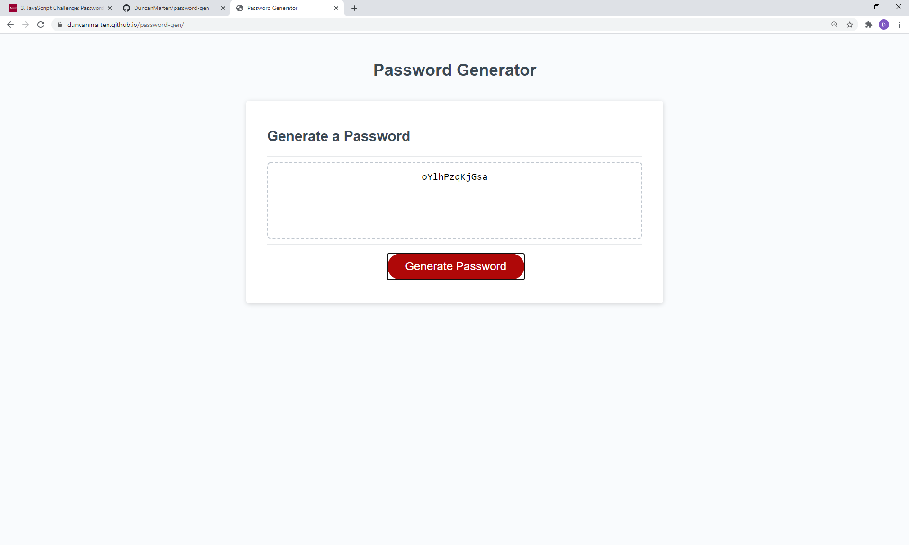

# Password-Generator

## Description

### Pupose

The main purpose of this website is to provide the user with a randomized password when they hit the generate button.  The user can change what characters they want in the password along with the length of the password.  They will be prompted to choose the length of password and if they want lowercase letters, uppercase letters, numbers and/or symbols in their password.  Its a simple design and easy to read for any user that wants a random password.

View webpage at: (https://duncanmarten.github.io/password-gen/)

### Built With

* HTML
* CSS
* Javascript

